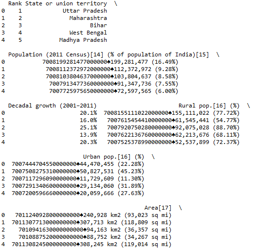
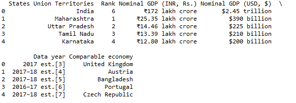
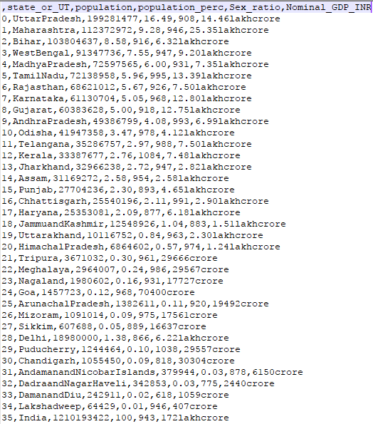

# Web Scrapping using Beautiful soup and Pandas

Aim of this project is to present the GDP of every state and union territory in India respective to the state name, its population and sex ratio
However the required data is divided as it is available on different weblinks 

This project is focused towards extracting data from web from two different links:
Link 1 : https://en.wikipedia.org/wiki/List_of_states_and_union_territories_of_India_by_population
		   It has the information about State and union territory names, population and sex ratio

Link 2 : https://en.wikipedia.org/wiki/List_of_Indian_states_and_union_territories_by_GDP
		   It has the information about State and union territory names and GDP

The common attribute that both the links have is State and union territory names, according to which all the data is arranged respectively 
and written into CSV file.

Steps performed:

1. Extracting the data from webpages
2. Converting data from tables into pandas dataframe
3. Cleaning the columns as there was lot of hidden information in the data
4. Arranging the data respective to particular states
5. Writing the data to CSV file
	
## Step by Step

```python
import pandas as pd
import urllib
from bs4 import BeautifulSoup


'''Extracting the data from the first link '''

url = "https://en.wikipedia.org/wiki/List_of_states_and_union_territories_of_India_by_population"
page = urllib.request.urlopen(url).read()
soup = BeautifulSoup(page,"lxml")
for t in soup.find_all('table'):
    for tr in t.find_all('tr'):
        for td in tr.find_all('td'):
            if (td.text == 'Karnataka'):
                    req_t = t

df1 = pd.read_html(str(req_t),header =0)
df2 = df1[0]
df2.columns
```
## Output of unclean Data from Link 1


```python
'''Cleaning the data from every column'''

df2["population_temp"]=df2["Population (2011 Census)[14] (% of population of India)[15]"].str.replace(r'.*000000*.', '')

col = lambda x: pd.Series([i for i in reversed(x.split(' '))])

rev = df2['population_temp'].apply(col)
df2['population']=rev[1]
df2['population_perc']=rev[0]

df2['population_perc']=df2['population_perc'].str.replace(r'.*\(', '')
df2['population_perc']=df2['population_perc'].str.replace(r'\%\)', '')

df2['population']=df2['population'].str.replace(r'\,', '')
df2['population']=df2['population'].str.replace(r'b', '')

df2["state_or_UT"]=df2["State or union territory"]
df2["Sex_ratio"]=df2["Sex ratio"]

statewise_population=df2[["state_or_UT","population","population_perc","Sex_ratio"]]

'''Extracting the data from the second link'''

url = "https://en.wikipedia.org/wiki/List_of_Indian_states_and_union_territories_by_GDP"
page = urllib.request.urlopen(url).read()
soup = BeautifulSoup(page,"lxml")
for t in soup.find_all('table'):
    for tr in t.find_all('tr'):
        for td in tr.find_all('td'):
            if (td.text == '$390 billion'):
                req_t = t

df1 = pd.read_html(str(req_t),header =0)
df2 = df1[0]
df2.columns
```

## Output of unclean Data from Link 2


```python
print (df2.head())
'''renaming the column names'''

df2["Nominal_GDP_INR"]=df2[u'Nominal GDP (INR, Rs.)']
df2["state_or_UT"]=df2[u'States Union Territories']

'''Cleaning the data'''

df2['Nominal_GDP_INR']=df2['Nominal_GDP_INR'].str.replace(u"₹",u"")
df2['Nominal_GDP_INR']=df2['Nominal_GDP_INR'].str.replace(u"₹",u"")
df2['Nominal_GDP_INR']=df2['Nominal_GDP_INR'].str.replace(u" ",u"")
df2['Nominal_GDP_INR']=df2['Nominal_GDP_INR'].str.replace(u",",u"")
df2['Nominal_GDP_INR']=df2['Nominal_GDP_INR'].str.replace(u"₹",u"")

statewise_GDP=df2[["state_or_UT","Nominal_GDP_INR"]]

statewise_analytical_data=pd.merge(statewise_population, statewise_GDP, on='state_or_UT', how='inner')

statewise_analytical_data["state_or_UT"]=statewise_analytical_data["state_or_UT"].str.replace(u" ",u"")
statewise_analytical_data["state_or_UT"]=statewise_analytical_data["state_or_UT"].str.replace(u"β",u"")

repr(statewise_analytical_data["population"])
statewise_analytical_data["population"]=statewise_analytical_data["population"].str.replace(u'\xc2\x99\xc2\xa0',"")

statewise_analytical_data['population'].astype(str).astype(float)

'''Creating a CSV file and adding information to it'''

statewise_analytical_data.to_csv("statewise_analytical_data.csv")
statewise_analytical_data_1=pd.read_csv("statewise_analytical_data.csv")
```

## Output of the created CSV file
