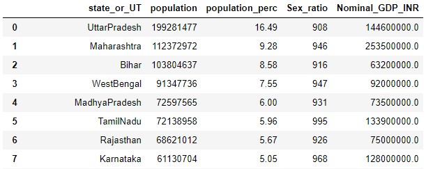
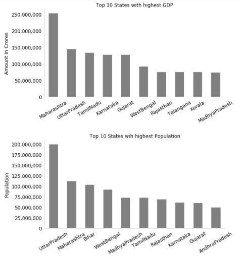
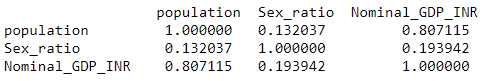

Aim of this project is to present the GDP of every state in India respective to the state name, its population and sex ratio. The required data is divided as it is available on different urls.

## Steps performed:

1. Extracting the data with BeautifoulSoup and converting it in a dataframe
2. Cleaning the data (special characters, percentage...)
4. Merge the two dataframes
5. Plots of the highest GDP and the highest population
6. Determine correlation between GDP, population and sex ratio with a confusion matrix
	
## Step by Step

```python
import pandas as pd
import urllib
from bs4 import BeautifulSoup
import matplotlib.pyplot as plt

''' Extracting the data from the first link '''

url = "https://en.wikipedia.org/wiki/List_of_states_and_union_territories_of_India_by_population"
page = urllib.request.urlopen(url).read()
soup = BeautifulSoup(page,"lxml")
for t in soup.find_all('table'):
    for tr in t.find_all('tr'):
        for td in tr.find_all('td'):
            if (td.text == 'Karnataka'):
                    req_t = t

df1 = pd.read_html(str(req_t),header =0)
df2 = df1[0]
 

''' Cleaning the data from the first link '''

df2["population_temp"]=df2["Population (2011 Census)[14] (% of population of India)[15]"].str.replace(r'.*000000*.', '')

col = lambda x: pd.Series([i for i in reversed(x.split(' '))])

rev = df2['population_temp'].apply(col)
df2['population']=rev[1]
df2['population_perc']=rev[0]
df2['population_perc']=df2['population_perc'].str.replace(r'.*\(', '')
df2['population_perc']=df2['population_perc'].str.replace(r'\%\)', '')
df2['population']=df2['population'].str.replace(r'\,', '')
df2['population']=df2['population'].str.replace(r'b', '')
df2["state_or_UT"]=df2["State or union territory"]
df2["Sex_ratio"]=df2["Sex ratio"]

statewise_population=df2[["state_or_UT","population","population_perc","Sex_ratio"]]


''' Extracting the data from the second link '''

url = "https://en.wikipedia.org/wiki/List_of_Indian_states_and_union_territories_by_GDP"
page = urllib.request.urlopen(url).read()
soup = BeautifulSoup(page,"lxml")
for t in soup.find_all('table'):
    for tr in t.find_all('tr'):
        for td in tr.find_all('td'):
            if (td.text == '$390 billion'):
                req_t = t

df1 = pd.read_html(str(req_t),header =0)
df2 = df1[0]
df2.columns


''' Changing column names & cleaning the data '''

df2["Nominal_GDP_INR"]=df2[u'Nominal GDP (INR, Rs.)']
df2["state_or_UT"]=df2[u'States Union Territories']

df2['Nominal_GDP_INR']=df2['Nominal_GDP_INR'].str.replace(u"₹",u"")
df2['Nominal_GDP_INR']=df2['Nominal_GDP_INR'].str.replace(u"₹",u"")
df2['Nominal_GDP_INR']=df2['Nominal_GDP_INR'].str.replace(u" ",u"")
df2['Nominal_GDP_INR']=df2['Nominal_GDP_INR'].str.replace(u",",u"")
df2['Nominal_GDP_INR']=df2['Nominal_GDP_INR'].str.replace(u"₹",u"")
df2['Nominal_GDP_INR']=df2['Nominal_GDP_INR'].str.replace(u".",u"")
df2['Nominal_GDP_INR']=df2['Nominal_GDP_INR'].str.replace(u"lakh",u"00000")

statewise_GDP=df2[["state_or_UT","Nominal_GDP_INR"]]


''' Merge the two dataframes '''

data=pd.merge(statewise_population, statewise_GDP, on='state_or_UT', how='inner')

data["state_or_UT"]=data["state_or_UT"].str.replace(u" ",u"")
data["state_or_UT"]=data["state_or_UT"].str.replace(u"β",u"")
data["population"]=data["population"].str.replace(u'\xc2\x99\xc2\xa0',"")

data=data[:-1]
data['Nominal_GDP_INR']=data['Nominal_GDP_INR'].str.replace(u"crore",u"") # Cleaning the data
data["population"] = data["population"].astype(int) # Converting the column type
data["Nominal_GDP_INR"] = data["Nominal_GDP_INR"].astype(float) # Converting the column type
```

#### Merged dataframe


```python
''' Plotting the data '''

# Extract of the dataframe for plotting
plot_data=pd.concat([data["state_or_UT"],data["population"],data["Nominal_GDP_INR"]], axis=1)
plot_data = plot_data.set_index("state_or_UT", drop=True)

# PLotting the states with the highest GDP
largest_gdp = plot_data["Nominal_GDP_INR"].nlargest(10)
ax = largest_gdp.plot(kind='bar',y="Nominal_GDP_INR",title ="Top 10 States with highest GDP", figsize=(8, 4),fontsize=12,facecolor='grey')
ax.set_xlabel("", fontsize=12)
ax.set_ylabel("Amount in Crores",fontsize=12)
ax.get_yaxis().set_major_formatter(plt.FuncFormatter(lambda x, loc: "{:,}".format(int(x))))
ax.spines["top"].set_visible(False)    
ax.spines["right"].set_visible(False) 
ax.spines['bottom'].set_color('#CCCCCC')
ax.spines['bottom'].set_linewidth(1)
ax.spines['left'].set_color('#CCCCCC')
ax.spines['left'].set_linewidth(1)
plt.tick_params(axis="both", which="both", bottom="off", top="off",    
                labelbottom="on", left="off", right="off", labelleft="on")
plt.xticks(rotation=30)
plt.show()

# PLotting the states with the highest population
largest_gdp = plot_data["population"].nlargest(10)
ax1 = largest_gdp.plot(kind='bar',y="Nominal_GDP_INR",title ="Top 10 States wih highest Population", figsize=(8, 4),fontsize=12,facecolor='grey')
ax1.set_xlabel("", fontsize=12)
ax1.set_ylabel("Population",fontsize=12)
ax1.get_yaxis().set_major_formatter(plt.FuncFormatter(lambda x, loc: "{:,}".format(int(x))))
ax1.spines["top"].set_visible(False)    
ax1.spines["right"].set_visible(False) 
ax1.spines['bottom'].set_color('#CCCCCC')
ax1.spines['bottom'].set_linewidth(1)
ax1.spines['left'].set_color('#CCCCCC')
ax1.spines['left'].set_linewidth(1)
plt.tick_params(axis="both", which="both", bottom="off", top="off",    
                labelbottom="on", left="off", right="off", labelleft="on")
plt.xticks(rotation=30)
plt.show()
```

#### Plots of the highest GDP and highest population



''' Finding the co-relation between the columns '''

```python
d=data.corr()
print ("The confusion matrix: \n",d)
```

#### Confusion matrix
